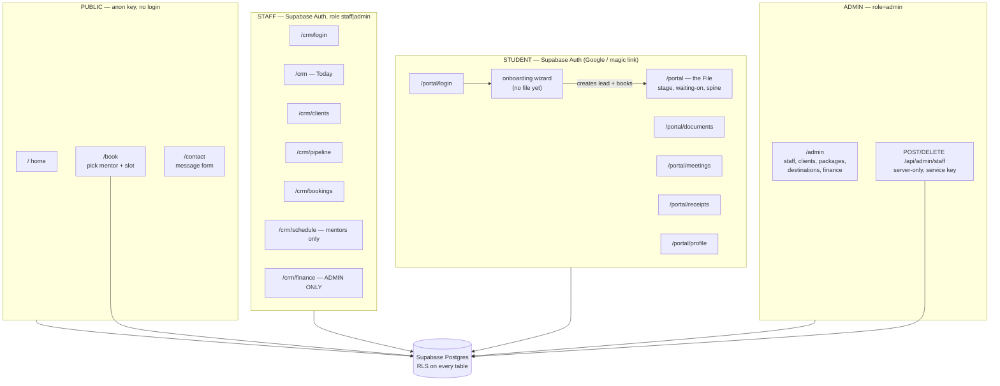

# NextUp Mentor — Project Map

**Written for whoever picks this up next, human or model.** Read this before
`IMPLEMENTATION_PLAN.md`, which describes an Express/Prisma rebuild that was
never started and is not the codebase.

Last updated: 2026-08-22.

---

## 1. What this is

A study-abroad consultancy in Bangladesh placing students in Italy, Lithuania,
Hungary and Germany. Next.js 16 (App Router) + React 19 + Tailwind v4, Supabase
for everything server-side. Deployed on Vercel at **nextupmentor.com**, which
**auto-deploys from `master`**. Migrations are applied straight to the
production database, so schema changes are live before the frontend deploys.

152 source files · 27 migrations · 21 tables · 26 functions · 66 RLS policies.

---

## 2. The five surfaces

`/staff_portal` was merged into `/crm` and now 308-redirects.

---

## 3. Auth model — the thing to understand first

Three **separate** Supabase clients, deliberately, each with its own storage key:

| Client | File | Used by |
|---|---|---|
| `supabase` (anon) | `lib/supabase.ts` | public pages only |
| `staffSupabase` | `lib/auth/supabase-staff.ts` | CRM, admin, all staff services |
| `portalSupabase` | `lib/portal/supabase-portal.ts` | student portal |

They are separate so a staff member and a student sharing a browser cannot be
confused for one another, and so the portal's OAuth redirect handling
(`detectSessionInUrl`) does not race the staff client for the same token.

**Identity resolution.** `claim_staff_account()` binds an auth user to a
pre-created `staff` row by email — an admin creates the row with an email, the
person signs in, the two join. Same claim-by-email pattern as the student portal.
Username `admin` expands to `admin@nextupmentor.com` by convention
(`resolveIdentifier`), so no email address ships in the bundle.

**Enforcement is RLS, not the UI.** `is_admin()` / `is_staff()` /
`current_staff_id()` are `SECURITY DEFINER STABLE` — definer so policies on
`staff` don't recurse, stable so the planner calls them once per statement.
Role in React decides what renders; Postgres decides what is readable.

---

## 4. Migrations 0010–0026, and why

| # | What |
|---|---|
| 0010 | roles + email + auth link on `staff`; is_admin/is_staff helpers; scoped the client-documents bucket (was world-readable) |
| 0011 | **destructive** wipe: clients, appointments, finance. Backup in `./backups/` (gitignored, real PII) |
| 0012 | cutover — dropped the legacy `Allow all` policies. They were role `public`, which **includes `authenticated`**, so finance was readable by any signed-in account including students |
| 0013 | **enabled RLS on packages, destinations, messages, enrollments** — it was OFF, so every policy on them was decorative and contact submissions were world-readable |
| 0014–16 | stage history + waiting-time benchmarks, with two honesty gates |
| 0017 | student profile + avatar (private bucket) |
| 0018 | portal onboarding + dated slots + double-booking guard |
| 0019 | `is_mentor` flag; booked availability windows locked |
| 0020 | staff book on a client's behalf; cancellation |
| 0021 | phone uniqueness scoped to public bookings (see §6) |
| 0022 | staff-added visa requirements, flagged to the student |
| 0023 | staff avatars (public bucket — a mentor's photo is shown to anonymous visitors) |
| 0024 | receipts + portal notifications |
| 0025/26 | staff deletion rules: anyone but yourself, never the last admin |
| 0027 | `site_stats` — the four home-page figures, editable in Admin → Home figures |
| 0028 | `feature_photos` — the sliding photo card on the hero, Admin → Home photos |

---

## 5. Design principles that are load-bearing

**The student portal never shows a number it cannot evidence.**
`client_stage_events.source` is `recorded` vs `inferred`; only recorded data
produces a day count. `portal_stage_benchmark()` has two gates: n ≥ 5, and
distinct values ≥ 60% of n. The second exists because importing the archive
produced 16 samples with 4 distinct values — bulk-UPDATE artifacts that would
have told a student "38 days" on no evidence. Sample size is always displayed.

**Money is stored in minor units** (poisha). Totals are derived in a view, never
stored — two columns that must agree eventually won't.

**Receipt fields are copied, not joined.** A later rename or repricing must not
silently alter an issued document. Receipt numbers come from a real sequence,
gap-free, claimed inside the transaction.

**Every state says who holds the file** — You / Your consultant / The
universities / The embassy. For an anxious student, "Nothing needed from you" is
the most valuable sentence the product can say.

---

## 6. Traps this codebase has already sprung

Each of these cost real debugging. They will recur.

1. **A blocked write returns HTTP 204, same as a successful one.** RLS blocks by
   matching zero rows, and PostgREST answers 204 either way. Two separate bugs
   hid here. Never judge a write by status code — re-read the row, or use
   `Prefer: return=representation` and assert the set.

2. **Policies are inert when RLS is off.** Check `pg_class.relrowsecurity`, not
   `pg_policies`, when verifying a table is protected.

3. **`public` includes `authenticated`.** A legacy `TO public` policy silently
   defeats a new restrictive one, because policies OR together.

4. **A UNIQUE index on a column written as `''`.** `idx_appointments_phone` was
   table-wide unique; portal bookings wrote `COALESCE(whatsapp,'')`, so the
   second client without a WhatsApp number collided. It surfaced as "that time
   was just taken" because the handler assumed every unique_violation was a
   double-booking. Always check *which* constraint failed.

5. **html2canvas cannot capture through a CSS transform.** It measures with
   `getBoundingClientRect` (scaled) while styles are natural size. Measured: ink
   spanned 380px of a 1000px canvas at `scale(0.36)`, vs 916px off-screen. Hence
   `ReceiptCapture` — a second unscaled copy at `left:-20000px`. Off-screen, not
   `display:none`, or there is no geometry to measure at all.

6. **Autocorrect rewrites hyphens as en dashes.** A correct password was rejected
   repeatedly. `signIn` now normalises dashes, smart quotes and NBSP; generated
   passwords are alphanumeric only.

7. **Deleting a staff row leaves a working login.** The auth user survives, the
   person signs in, and the gate finds nobody — which used to re-render the login
   form, indistinguishable from a wrong password. `DELETE /api/admin/staff`
   removes the auth user *first*.

8. **`.select()` after an insert breaks anon writes.** It issues a RETURNING,
   which needs SELECT — and anon has INSERT-only on appointments, messages and
   enrollments by design. All three public forms were silently broken from 0012
   until it was found. Measured: `return=minimal` -> 201, `return=representation`
   -> 42501. A test that used `return=minimal` passed and proved nothing; test
   the shape the app actually sends.

9. **Timezone.** Availability is wall-clock Asia/Dhaka; `scheduled_at` is
   timestamptz. Postgres `current_date` is UTC and will disagree with the local
   work day — this made an attendance test look like a failed write.

---

## 7. Current state (2026-08-22)

- **1 staff: Fahim (admin).** **0 mentors — booking is dead until someone is
  ticked as a mentor and sets hours.**
- 9 clients, 6 receipts, 6 notifications, 49 stage events, 76 duration samples.
- RLS enabled on all 21 tables.
- Google sign-in works (first successful sign-in in project history was
  2026-08-19; before that the redirect allow-list was empty and nobody had ever
  completed one).

**Config that is NOT in the repo** (`.env.local`, gitignored):
`NEXT_PUBLIC_SUPABASE_URL`, `NEXT_PUBLIC_SUPABASE_ANON_KEY`, `GROQ_API_KEY`,
`ADMIN_*`, `SUPABASE_SERVICE_KEY`. The service key is also set in Vercel.

---

## 8. Outstanding

| Item | State |
|---|---|
| **Live chat** on the homepage replacing the AI bot | not started. Blocked on one decision: when nobody is online, does it take a message, fall back to the bot, or push to WhatsApp? |
| **Emailing receipts** | needs an email provider (Resend/Brevo). Supabase's mailer only sends auth email |
| **SMTP** generally | unconfigured; the magic-link fallback will throttle |
| Google consent screen shows `owinpapcuwywxlmzomrr.supabase.co` | fix is free: set App name + logo under Google Cloud → Branding. Needs `/privacy` and `/terms` pages, which do not exist |
| `Fahim01883@` in git history | old admin password, 2 commits. No longer grants anything; purging needs a force-push rewrite |
| Admin panel visual redesign | requested, not done |

**Do not** re-add anon access to staff tables. **Do not** trust a 204. **Do not**
show a student a number without checking what happens when the data is thin.
